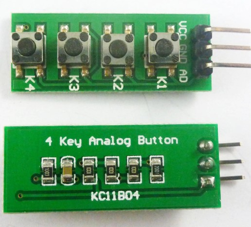
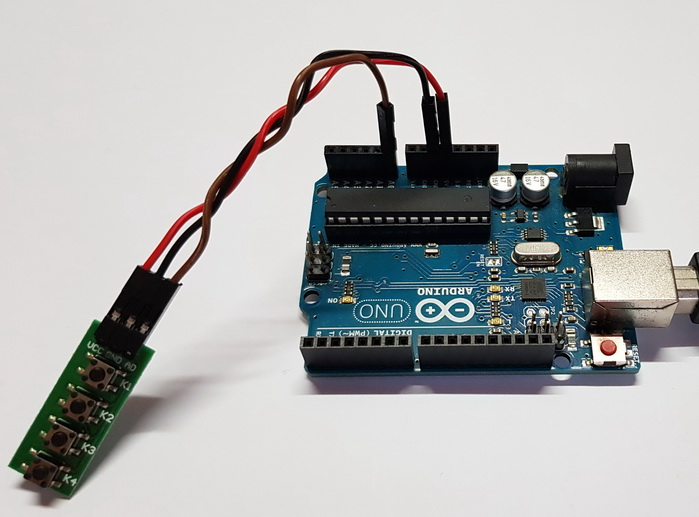
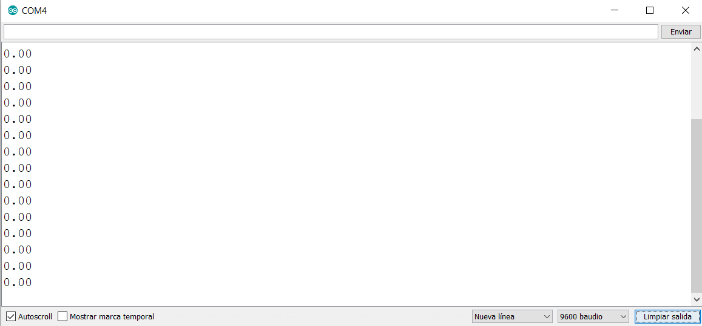
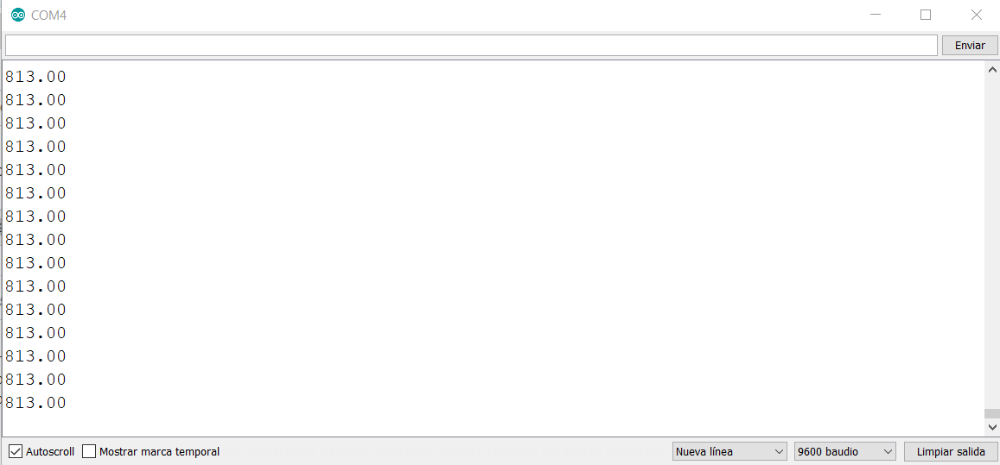
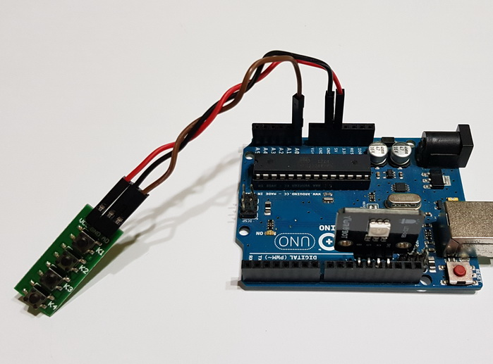
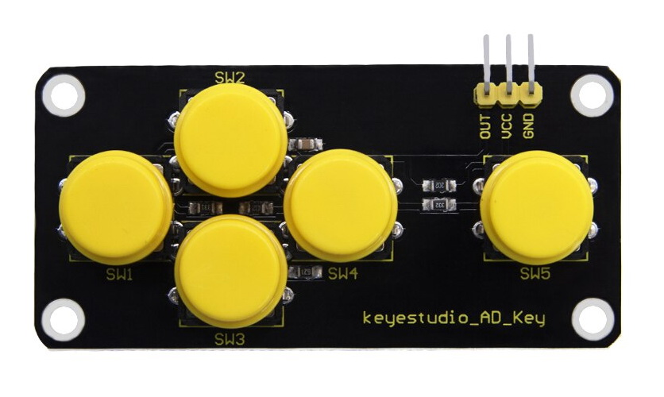
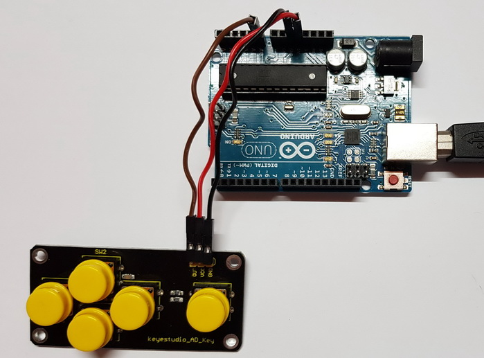

# Calibrando los pulsadores analógicos

En esta página vamos a ver cómo he conseguido calibrar estos dos pulsadores, lo cual nos puede llevar a interesantes actividades con nuestro alumnado de E.S.O.

## _Teclado analógico de 4 botones KC11B04_

En este teclado, [como se ha visto](TecladoAnalogico.md), tenemos cuatro botones sobre la placa, y tres pines:
- Vcc, alimentación.
- GND, masa.
- A0, que irá conectado a la entrada analógica.

Realizamos el siguiente montaje:

Y elaboramos un sencillo programa que nos envía a la consola serie la lectura del valor que tenemos en la entrada A0.
Lo tenemos disponible en [este enlace](http://www.arduinoblocks.com/web/project/174238) (Arduinoblocks), o bien en el código de aquí abajo:

~~~cpp
double teclado;
void setup(){
    Serial.begin(9600);
    pinMode(A0, INPUT);
    teclado = 0;
}

void loop()
{
    teclado = analogRead(A0);
    Serial.println(teclado);
    delay(100);
}
~~~

Realizamos diversas pulsaciones a los botones, y observamos que se obtienen diferentes valores en la consola serie:

Esto va bien.  

No obstante, vemos que al mantener una tecla pulsada (por ejemplo, la tecla K2) el valor que se obtiene en A0 no es un valor exacto, sino que oscila un poquito.  

Esto nos lleva a pensar que no podremos hablar en nuestros programas de un **valor de A0**, sino de un **intervalo en el que se podrá encontrar A0**. Esto es fundamental para nuestros programas, porque si no lo tenemos en cuenta, podremos confundir una pulsación con una ausencia de la misma, o viceversa.

Para registrar los datos, hemos utilizado el programa Realterm que nos permite, tal y como se explica en [este artículo](http://real2electronics.blogspot.com/2009/11/graficar-con-kst.html), capturarlos y guardarlos en un archivo. Incluso, como se indica en dicho artículo, podríamos graficar los datos con KST, si fuera necesario, pero no lo vamos a hacer.

Una vez que hemos obtenido una muestra lo suficientemente grande de valores para cada una de las pulsaciones:
- K1
- K2
- K3
- K4
- K1+K2
- K1+K3
- K2+K3

y los hemos guardado en un archivo, los llevo a [esta hoja de cálculo](https://docs.google.com/spreadsheets/d/1GfoAlHANnyHcyWd9eGNL7__1PUo6nhGNXoAeHEWXHp4/edit?usp=sharing), donde los procesamos.

Calculamos la media aritmética de los valores observados, así como la desviación típica de cada conjunto de datos. Una vez hecho esto, utilizamos el "criterio de las 3 sigmas" (el intervalo de confianza estará entre media-3 x sigma y media + 3 x sigma), y obtenemos los siguientes intervalos:

   _  |   K1    |    K2   |  K3     | K4    |
:---: |  :---:  |  :---:  | :---:   | :---: |
K1    | 400-410 | 502-512 | 673-681 | >1020 |
K2    |         | 602-612 | 758-768 | >1020 |
K3    |         |         | 808-818 | >1020 |
K4    |         |         |         | >1020 |

En esta tabla de doble entrada indicamos la pulsación simultánea de dos pulsadores: por ejemplo K1 con K1 indica que sólo se pulsa la tecla K1.

Fnalmente, para hacer la comprobación del funcionamiento, hacemos este sencillo montaje, con el LED RGB conectado directamente a los pines 11, 12, 13 y GND de Arduino.

creamos un sencillo programa para hacer que un LED RGB muestre distintos colores en función de la tecla que se haya pulsado.  
Tenemos este programa en [este enlace](http://www.arduinoblocks.com/web/project/174214) (Arduinoblocks) o en el siguiente código:

~~~cpp
double teclado;

void setup()
{
  Serial.begin(9600);

pinMode(A0, INPUT);
pinMode(13, OUTPUT);
pinMode(12, OUTPUT);
pinMode(11, OUTPUT);
  teclado = 0;
}

void loop()
{
    teclado = analogRead(A0);
    Serial.println(teclado);
    if (((teclado >= 400) && (teclado <= 410))) {
      digitalWrite(13, HIGH);

    } else {
      digitalWrite(13, LOW);
      if (((teclado >= 602) && (teclado <= 612))) {
        digitalWrite(12, HIGH);

      } else {
        digitalWrite(12, LOW);
        if (((teclado >= 808) && (teclado <= 818))) {
          digitalWrite(11, HIGH);

        } else {
          digitalWrite(11, LOW);
          if (((teclado >= 502) && (teclado <= 512))) {
            digitalWrite(11, HIGH);
            digitalWrite(12, HIGH);

          } else {
            digitalWrite(11, LOW);
            digitalWrite(12, LOW);
            if (((teclado >= 673) && (teclado <= 681))) {
              digitalWrite(12, HIGH);
              digitalWrite(13, HIGH);

            } else {
              digitalWrite(12, LOW);
              digitalWrite(13, LOW);
              if (((teclado >= 758) && (teclado <= 768))) {
                digitalWrite(11, HIGH);
                digitalWrite(13, HIGH);

              } else {
                digitalWrite(11, LOW);
                digitalWrite(13, LOW);
                if ((teclado >= 1020)) {
                  digitalWrite(11, HIGH);
                  digitalWrite(12, HIGH);
                  digitalWrite(13, HIGH);

                } else {
                  digitalWrite(11, LOW);
                  digitalWrite(12, LOW);
                  digitalWrite(13, LOW);
                }
              }
            }
          }
        }
      }
    }
    delay(50);
}
~~~

El resultado puede verse en el siguiente vídeo:

---

## _Teclado analógico de 5 botones Keyestudio AD Key_

En este teclado, tenemos cinco botones sobre la placa, y ésta tiene también tres pines:
- OUT, que irá conectado a la entrada analógica
- Vcc, alimentación.
- GND, masas

Vamos a proceder de una forma muy parecida al teclado anterior.  

Realizamos el siguiente montaje para la adquisición de datos a un archivo:

Utilizamos [el mismo programa](http://www.arduinoblocks.com/web/project/174238) que con el teclado anterior para enviar los datos a la consola serie, y seguimos el mismo procedimiento para guardarlos en un archivo, poder analizarlos y subirlos a [esta hoja de cálculo](https://docs.google.com/spreadsheets/d/10xi-N_vE9RpEmJLrSJPZ8AfVkocjgYcwW_z636umT3Q/edit?usp=sharing) de Google Drive.

En dicha hoja de cálculo procesamos los datos y obtenemos los intervalos de funcionamiento para nuestro teclado Keyestudio:  

    _        |   SW1   |   SW2   |   SW3   |   SW4   |   SW5    |
     :---:   |  :---:  |  :---:  | :---:   |  :---:  |  :---:   |
 Valor de A0 |    0    | 144-146 | 330-332 | 505-507 |  741-744 |