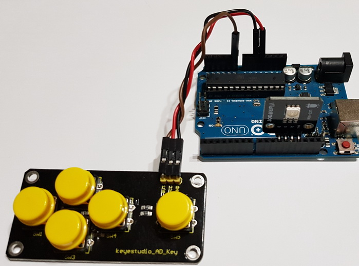

# Teclados Analógicos

Los teclados son muy necesarios en nuestros proyectos, dado que, muy habitualmente, necesitamos que reaccionen a sencillas pulsaciones del usuario.  
Un teclado digital precisa de tres cables para su funcionamiento, además de la colocación de una resistencia para poder realizar un pull-up o un pull-down.  
He descubierto unos teclados analógicos que permiten obtener, con una sola placa y tres cables, un número bastante elevado de pulsadores.  
He realizado la [calibración de cada uno](CalibrandoPulsadores.md) y un sencillo programa de prueba.  
Puedes echarles un vistazo a continuación

## _Teclado analógico de 4 botones KC11B04_

Este teclado posee cuatro botones, pero ofrece 7 salidas, dado que se pueden pulsar dos o tres teclas simultáneamente.
He encontrado el teclado en [este enlace](https://es.aliexpress.com/item/33057430287.html?spm=a2g0s.9042311.0.0.182f63c0vLlYX2).

He realizado este montaje:

cuya programación puedes ver en Arduinoblocks, en [este enlace](http://www.arduinoblocks.com/web/project/174214).

---

## _Teclado analógico de 5 botones Keyestudio AD Key_

Este teclado posee 5 botones, y son cinco las salidas que nos ofrece, dado que sólo se ofrece salida cuando se pulsa un único botón (curiosamente, **aunque hay más botones, tenemos menos salidas**).
Podemos encontrar este teclado en [este enlace](https://www.keyestudio.com/keyestudio-ad-key-button-module-for-arduino-p0589.html).

He realizado este montaje:

cuya programación puedes ver en Arduinoblocks, en [este enlace](http://www.arduinoblocks.com/web/project/174563).

---

## [Calibración de los pulsadores analógicos](CalibrandoPulsadores.md)
