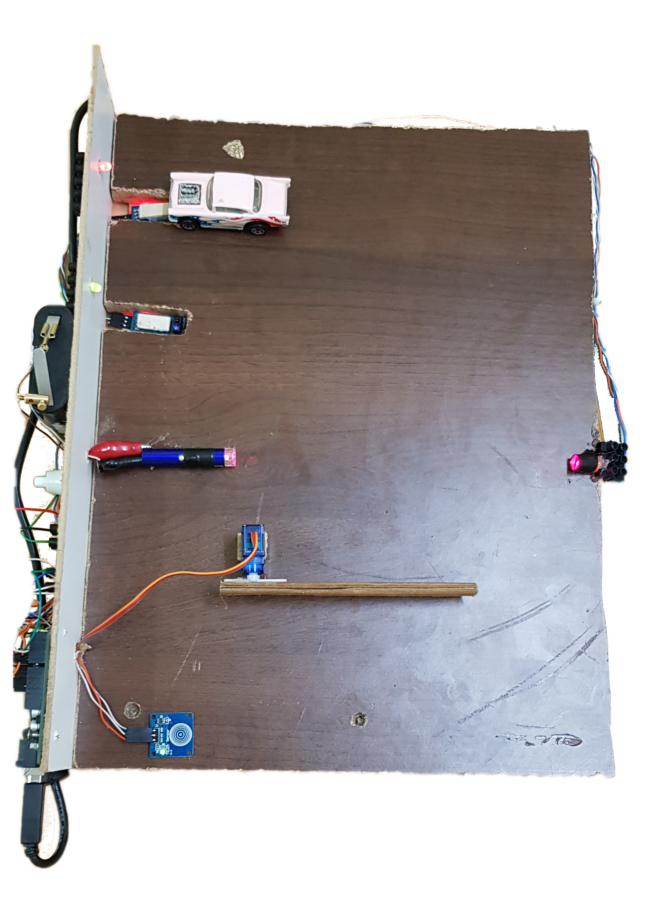
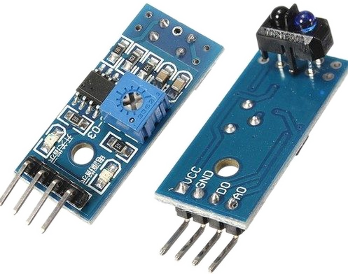
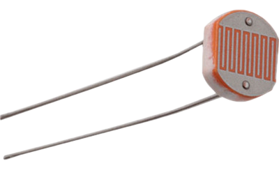
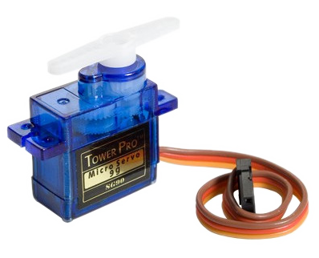
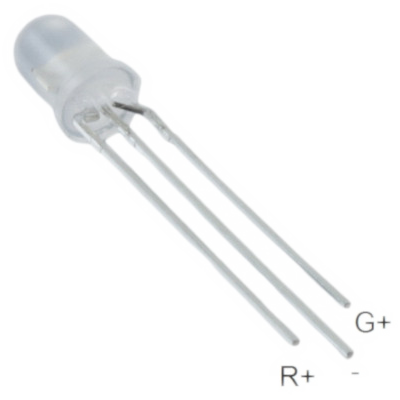
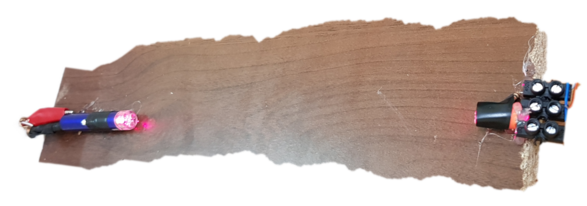
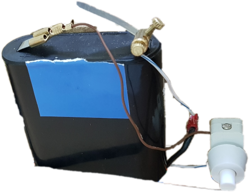
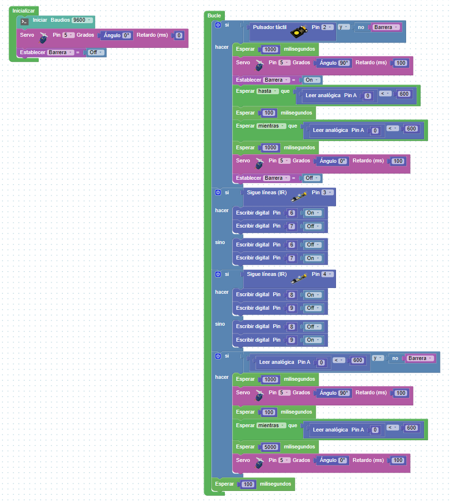

# Maqueta de Parking

Para la ExpoVilladiego de 2019, a los alumnos _**Diego Castilla, Alejandro Muñoz y Javier Muñoz**_ se les ocurrió la posibilidad de implementar la maqueta de un parking en la que introdujeran algunos **sensores** y **actuadores**.

Pensando, pensando, llegamos a la siguiente maqueta:

## Funcionamiento:

Cuando un vehículo llega al parking, se detiene ante la barrera. Para abrirla, tendremos que tocar el pulsador táctil capacitivo.
El vehículo ingresa al parking e interrumpe la barrera fotoeléctrica, pero la barrera no se bajará **hasta que deje de interrumpirla**, es decir, hasta que su parte trasera la supere.
En ese momento el se puede dirigir a la plaza que se encuentre libre. Se sabrá porque el led correspondiente lucirá de color verde.
Cuando el vehículo llega a la plaza, provoca la activación del sensor infrarrojo. Ello provocará el cambio de color del led a rojo, hasta que se libere la plaza.

Podemos ver todo esto en el siguiente vídeo:

## Materiales necesarios

### Sensores:

---
- **Pulsador táctil capacitivo**: lo colocamos a la entrada del parking, para provocar la apertura de la barrera.

---

- **Sensores infrarrojos (IR) TCRT5000**: colocamos un sensor en el suelo de cada una de las plazas del parking, para detectar (por reflexión) la presencia o no de un vehículo en la plaza.

---

- **Fotorresistencia LDR**: la colocaremos en serie con una resistencia 10K

---

### Actuadores:

- **Servomotor tipo SG90**: moverá la barrera.

---

- **Ledes RG**: nos indicarán la presencia de un coche en la plaza, iluminándose de color rojo, o la ausencia del mismo (iluminándose) en color verde. Hemos escogido éstos porque estaban disponibles en el aula y, aunque teníamos también ledes RGB, no teníamos necesidad de usar el canal B.

---

### Otros componentes electrónicos:
- Resistencias 220 ohm
- Resistencia 10K (divisor de tensión en la LDR)
- Placa Arduino UNO.
- Cableado con conectores DuPont.
- Pila de petaca (alimentación del puntero)
- Pinza de cocodrilo.

### Otros Materiales
- Base de aglomerado e = 16 mm.
- Contrachapado e = 4 mm.
- Pegamento termofusible.
- Puntero láser.

## El puntero láser

Con el puntero láser teníamos un pequeño problema: para encenderlo había que darle al pulsador que lleva en su parte superior. Esto, una vez que estuviera enfocado sobre la fotocélula, podía provocar la desactivación o el mal funcionamiento de la barrera, sencillamente porque se desviara de su posición.
Entonces pensamos que sería mucho más seguro encender o apagar el láser con un interruptor externo. También sería necesario cambiar la alimentación a una pila de petaca, para lo cual hicimos lo siguiente:
1. Desmontamos el puntero, y observamos que contenía 3 pilas de botón de 1,5 V.
2. Las pilas descansaban su polo negativo sobre un muelle en el interior del puntero.
3. El polo positivo de las mismas tocaba la carcasa metálica del puntero, provocando el cierre del circuito.
4. Para colocar el interruptor, tenemos que acceder fácilmente a los terminales + y -, para lo cual: roscamos un tornillo aislado con cinta al muelle interior. A la cabeza del tornillo fijamos un cable, que será el negativo del circuito del láser.
5. A la pinza de cocodrilo fijamos otro cable, y la sujetamos a la carcasa del puntero.
6. Sobre este cable colocamos el interruptor.
7. Conectamos a la pila cada uno de los cable, respetando la polaridad indicada.
8. Fijamos con cinta aislante el pulsador del puntero en la posición de encendido y... voilá, el puntero ya se puede controlar con un interruptor.

## Cableado del montaje

## Código en ArduinoBlocks

## Código Arduino

~~~
#include <Servo.h>
    boolean b_Barrera;
    Servo servo_5;
    int fnc_dynamic_analogRead(int _pin){
	  pinMode(_pin,INPUT);
	  return analogRead(_pin);
    }

void fnc_dynamic_digitalWrite(int _pin, int _e){
	  pinMode(_pin,OUTPUT);
  	digitalWrite(_pin,_e);
    }

void setup()
    {
    Serial.begin(9600);
    servo_5.attach(5);
    pinMode(2, INPUT);
    pinMode(3, INPUT);
    pinMode(4, INPUT);
    servo_5.write(0);
    delay(0);
    b_Barrera = false;
    }

void loop()
    {
    if ((digitalRead(2) && (!b_Barrera))) {
      delay(1000);
      servo_5.write(90);
      delay(100);
      b_Barrera = true;
      while(!(((fnc_dynamic_analogRead(0) < 600))));
      delay(100);
      while(((fnc_dynamic_analogRead(0) < 600)));
      delay(1000);
      servo_5.write(0);
      delay(100);
      b_Barrera = false;
    }

    if (digitalRead(3)) {
      fnc_dynamic_digitalWrite(6, HIGH);
      fnc_dynamic_digitalWrite(7, LOW);
    } else {
      fnc_dynamic_digitalWrite(6, LOW);
      fnc_dynamic_digitalWrite(7, HIGH);
    }

    if (digitalRead(4)) {
      fnc_dynamic_digitalWrite(8, HIGH);
      fnc_dynamic_digitalWrite(9, LOW);
    } else {
      fnc_dynamic_digitalWrite(8, LOW);
      fnc_dynamic_digitalWrite(9, HIGH);
    }

    if (((fnc_dynamic_analogRead(0) < 600) && (!b_Barrera))) {
      delay(1000);
      servo_5.write(90);
      delay(100);
      delay(100);
      while(((fnc_dynamic_analogRead(0) < 600)));
      delay(5000);
      servo_5.write(0);
      delay(100);
    }
    delay(100);
    }
~~~

[Descarga el código directamente](Parking2019.ino)

## Mejoras futuras (TO-DO).
- Control de las plazas libres. Si todo está ocupado, la barrera no abre.
- Activación y desactivación del láser mediante programación: cuando la barrera esté alta o cuando cambie el estado de un sensor de IR (cambia el estado de la plaza de aparcamiento)
- El programa queda bloqueado en la apertura de la barrera: si un coche que está aparcado se pone en marcha, su correspondiente led no cambiará de estado.
